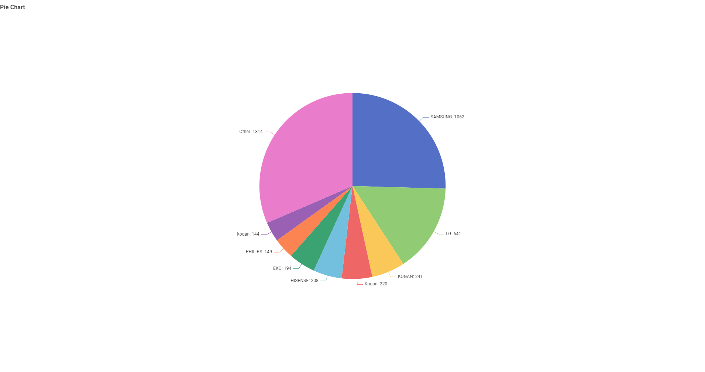

<h1>About the data</h1>

  The data chosen for the visualization is from the official Australian government website. Hence, the accuracy of the data is guaranteed. Meanwhile, there quite some limitation due to some data missing and privacy 
  is close to none since the dataset is available for the public to see and check.  
  
  The data processing: First of all, the data is cleanse by replacing any missing values with "Unknown" to make sure it is a complete data. Then, it checks for any duplicates row before being checked for 
  first letter capitalization to ensure consistency. Finally, it is being checked for any unnecessary column which would then be removed since it serves no purpose other than clogging up the work.  

  I declare that the data set I used is retrieved ethically and is being used meaningfully.

<h1>AI Declaration</h1>

  This assignment does not require any complicated or complex coding to do since most of it is just paragraph writing and imgae uploading which are basic knowledge for anybody familiar with HTML, & CSS. With that being said, I admit that I also use AI to help me with this assignment, but mainly for decoration purposes, and not anything crucial. Below is some examples of me using AI for assistance:  

<pre>
   

                

                    

                        
                    

                    

                        

                            This chart illustrates how many tv models each brands produced. As an individual brand, <b class="text-primary">SAMSUNG</b> takes the top spot taking a quarter of the pie chart
                            with over 1,000 models manufactured. Second highest individual tv brand belonged to <b class="text-primary">LG</b> with 641 models produced. 
                             
                             
                            The <b class="text-danger">Other</b> category, which is a combination
                            of other small brands that were not able to compete with one shown in the chart, takes the top spot for the most models made, but not as an individual brand,
                            with 1,300 models produced.
                        

                        

                    

                

            

</pre>

- This part of the code creates a row with two column containing the image on the left column and the explanation on the right. While creating this row, the right column dropped down further than the left column and I could not figure out what the problem is until I asked AI for help. And this pattern of implementation style would repeat itself over and over again which is what made up my website. And beside this, everything is mostly the same since its an old code from week 0 aside from some <b>Bootstrp</b>, a CSS framework I recently learned from one of my classes (Interface Design).

